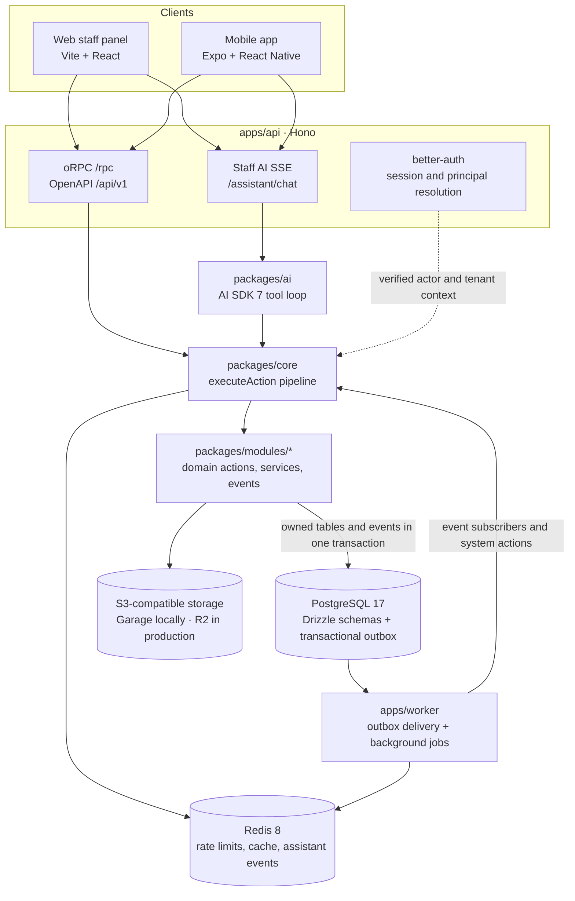

# Shozee 2.0

Shozee is a business operating platform for Ukrainian small businesses. It
brings CRM, catalog and flexible pricing, orders, documents, QES signing, and
an AI assistant into one product.

The owner-first release focuses on staff workflows in the mobile app and web
panel. The classic UI and the assistant execute the same domain actions, so
permissions, validation, audit, and business rules do not drift between
channels.

## Architecture

Shozee is a TypeScript modular monolith built around a typed action registry.
It keeps deployment and transactions simple while enforcing domain ownership
and cross-module boundaries in code and CI.



### Why this architecture

- **One data path.** Clients never access the database directly. Every
  business operation passes through `executeAction`, where authorization,
  validation, rate limits, confirmation, idempotency, audit, and output
  validation are applied consistently.
- **One capability for UI and AI.** Each operation has one client-safe
  contract and one server implementation. oRPC routes and assistant tools
  ultimately call the same handler; AI-specific façades may narrow model
  input and output without creating a second domain API.
- **Modular monolith instead of microservices.** Domain modules own their
  tables and logic, while a shared process and database preserve simple
  operations and reliable transactions. ESLint boundaries prevent modules
  from bypassing those ownership rules.
- **Explicit composition.** Synchronous cross-module reads use typed
  `ctx.call`; effects use domain events through a transactional outbox. Rare
  same-transaction writes must be declared atomic capabilities. This avoids
  hidden coupling without forcing distributed transactions.
- **Tenant scope comes from verified context.** A company identifier from
  action input is never an access grant. Core derives tenant scope from the
  authenticated principal or a typed target resolver, and cross-tenant
  isolation is covered by module tests.
- **Projections do not own domain state.** Orders, documents, and other
  domains remain authoritative. Chat cards, notifications, and future
  read-models store references and react to events instead of duplicating
  mutable business state.
- **Static contracts over runtime convention.** Drizzle schemas, Zod v4
  contracts, oRPC, and strict TypeScript carry types from storage to clients
  and AI tools. Contract checks fail CI when action metadata or an
  implementation is incomplete.
- **Human confirmation for irreversible work.** Payments, signing, deletion,
  and other high-risk actions use the core confirmation protocol. QES private
  keys remain on the user's device.
- **Replaceable infrastructure.** PostgreSQL, Redis, and the S3 API are
  self-hostable contracts. Local Garage and production Cloudflare R2 use the
  same storage interface.

### Action execution

1. A module declares a client-safe Zod contract with principal, permissions,
   risk, confirmation, idempotency, events, audit, and timeout metadata.
2. The API authenticates the request and resolves the principal and tenant
   context.
3. `packages/core` runs the action through the shared execution pipeline and
   opens the transaction.
4. The owning module executes its handler through Drizzle and may perform
   typed reads from other modules.
5. Domain events are committed to the PostgreSQL outbox with the state
   change. The worker delivers them idempotently to subscribers.

### Repository layout

```text
apps/
  api/                 Hono transport, auth, oRPC, OpenAPI, AI SSE
  worker/              Outbox delivery and pg-boss jobs
  mobile/              Expo mobile application
  web/                 Vite staff-panel SPA
packages/
  core/                Action runtime and execution protocols
  contract/            Client-safe oRPC/OpenAPI contract boundary
  db/                  Drizzle schemas, migrations, seeds, test harness
  modules/             Domain modules with owned actions, services, and events
  module-kit/          Shared server-side module utilities
  ai/                  AI SDK tool loop and channel adapters
  document-signing/    Ukrainian QES core for WASM, Node, and React Native
  config/              Validated runtime configuration
  validation/          Shared Zod schemas
  tooling/             TypeScript, ESLint, and formatting configuration
docs/                  Architecture, decisions, protocols, design, operations
```

## Technology stack

- **Platform:** Node.js 22+, ESM, TypeScript 6 in strict mode, pnpm 12,
  Turborepo 2.
- **API and contracts:** Hono 4, oRPC 1, Zod 4, better-auth 1.6, generated
  OpenAPI aliases, Pino 10, Sentry 10.
- **Data and background work:** PostgreSQL 17, Drizzle ORM 0.45 and
  drizzle-kit 0.31, Redis 8, pg-boss 12 for background jobs (ADR-0041),
  transactional outbox with PostgreSQL `LISTEN`/`NOTIFY`.
- **Object storage and files:** S3-compatible API, Garage 2.3 locally,
  Cloudflare R2 in production, Sharp 0.35 for image processing.
- **AI:** Vercel AI SDK 7 with the Anthropic provider, streamed through Hono
  SSE and connected to the same action registry as the UI.
- **Mobile:** Expo 57, React Native 0.86, React 19, Expo Router 57,
  Unistyles 3, TanStack Query 5, React Hook Form 7, Reanimated 4, FlashList 2.
- **Web panel:** Vite 8, React 19, TanStack Router 1, TanStack Query 5,
  Tailwind CSS 4. The public storefront is a separate later application; its
  framework is intentionally not selected yet.
- **Documents and QES:** React PDF Renderer 4 plus UAPKI integrations through
  WASM on web/Node and Nitro Modules on React Native.
- **Quality:** ESLint 10 with architectural boundaries, Prettier 3, Vitest 4,
  Testcontainers 12, and Playwright 1.

## Documentation

- [`docs/blueprint.md`](docs/blueprint.md) — product architecture, invariants,
  and high-level system design.
- [`docs/scope.md`](docs/scope.md) — product scope, launch order, and deferred
  capabilities.
- [`docs/adr/`](docs/adr/) — accepted architecture decision records and their
  rationale.
- [`docs/module-ownership.md`](docs/module-ownership.md) — domain ownership and
  permitted composition paths.
- [`docs/specs/`](docs/specs/) — frozen foundation protocols for core,
  contracts, database, money, security, and companies.
- [`docs/design/`](docs/design/) — UX research, design system, and mappings
  from product designs to implementation.
- [`docs/operations/`](docs/operations/) — backups, restore drills, incidents,
  alerts, CI flakes, and branch protection.
- [`docs/reference/`](docs/reference/) — curated Showzy v1 references used for
  migration and compatibility research.
- [`AGENTS.md`](AGENTS.md) — repository constraints and contribution workflow
  for coding agents.

The executable contract for a feature is its Linear card together with the
module's `*.contract.ts` files and required tests. Architectural deviations
require an accepted ADR.

## Local development

Prerequisites: Node.js 22+, pnpm 12, and Docker.

```bash
pnpm install
cp .env.example .env
docker compose up -d
pnpm --filter @showzy/db db:migrate
```

Runtime configuration is validated at boot by `packages/config`. Invalid or
incomplete configuration fails fast without logging secret values.

Start the runtime in separate terminals, the worker first: it provisions the
job queues, and an API booted before them fails fast.

```bash
pnpm --filter @showzy/worker start
pnpm --filter @showzy/api start
pnpm --filter @showzy/web dev
```

The mobile app uses Unistyles 3 and requires an Expo development build; Expo
Go is not supported.

```bash
cp apps/mobile/.env.example apps/mobile/.env
pnpm --filter @showzy/mobile start -- --dev-client
```

For a physical device, configure `EXPO_PUBLIC_API_URL` and
`S3_PUBLIC_ENDPOINT` with the development machine's LAN address instead of
`localhost`.

## Verification

```bash
pnpm format:check
pnpm typecheck
pnpm lint
pnpm test:unit
pnpm test:db
```

`pnpm test` runs the unit suite followed by the PostgreSQL integration suite.
Database tests use Testcontainers and therefore require Docker.
