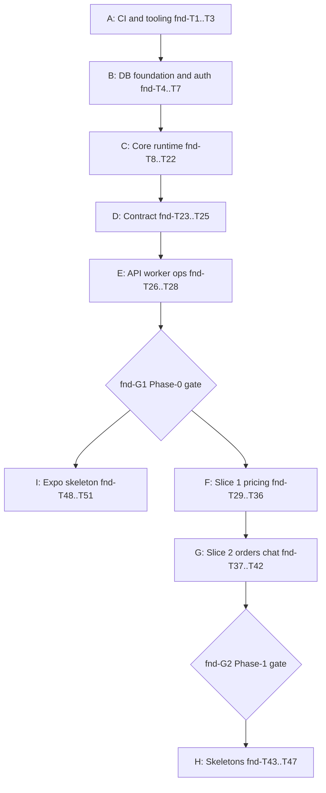

# Foundation (Phases 0–1) — Plan

> **Archived 2026-08-21.** Historical phase 0/1 task graph. **Not authority.**
> Do not execute leftover `fnd-T*` tickets from this file. Current process:
> `docs/pipeline.md` and ADR-0023. UX: ADR-0024 and
> `docs/design/mapping/mp-to-mobile.md`.

> Status: **historical after ADR-0023**. Leftover foundation packages still
> use `/scaffold`. Remaining reference-slice / domain work uses `/feature`,
> not this file's `/scaffold` + spec-gate language.
>
> Status was **rebaselined after fnd-T4, approved by owner 2026-08-17**.
> Tasks fnd-T1…T4 are merged; the remaining task contracts below include the
> ADR-0019/0020/0021 mobile-parity rework.
>
> Sources: [`docs/blueprint.md`](../../blueprint.md) (§2.1, §4, §5, §7),
> [`docs/scope.md`](../../scope.md) (§7 phases 0–1),
> [`docs/pipeline.md`](../../pipeline.md),
> [`.cursor/commands/scaffold.md`](../../../.cursor/commands/scaffold.md),
> protocol manuals (`core`, `db`, `contract`, `security-operations`, `money`,
> `companies-foundation`), archived domain novels in `docs/archive/specs/`,
> ADR-0012…0016, ADR-0018…0023,
> [`docs/module-ownership.md`](../../module-ownership.md).

This is the task breakdown for **Phase 0 (Foundation)** and **Phase 1
(Reference Slices)** as one coordinated sequence. Unlike module plans, the
implementer is the **scaffold agent** (`/scaffold`, not `/ticket`):

- **Execution is strictly sequential** — one task = one branch = one PR
  ≤ ~300 diff lines, every PR gets **full human review** (pipeline.md §3).
  "Parallel-eligible" below means *order-independent*: the human may reorder
  or interleave those tasks, but never runs two scaffold PRs at once.
- Tasks marked `sensitive` touch auth, payments, or tenant/runtime protocols:
  strongest implementer model + security review + full human review.

## Execution checkpoint — do not regenerate the scaffold

- **Merged and retained:** fnd-T1 monorepo/tooling, fnd-T2 CI, fnd-T3
  Compose/config, and fnd-T4 DB foundation tables/roles.
- Do not rerun `/scaffold` from the beginning and do not replace generated
  migrations. Continue from **fnd-T5** on a fresh branch from the latest
  merged base.
- New requirements are additive follow-up slices: fnd-T5A provides projection
  DB capabilities/fixtures; fnd-T19A provides atomic calls; **fnd-T11B**
  adds the seventh `share` principal (ADR-0022) after phase 0 merged;
  **fnd-T23B** adds HTTP/oRPC share dispatch after the contract.md
  2026-08-19 amendment. Existing merged work is changed only by a focused
  follow-up when a new test proves it must change.
- Every task still follows tests-first, one branch/PR, and ~300-line review
  budget. The UX gate still blocks product UI; technical shell/auth/link work
  remains the only mobile exception.
- Milestones are listed in **queue order**: A → B → C → D → E → **I** (Expo,
  owner-positioned after the phase-0 gate) → F → G → H. Task IDs are stable
  and do not re-sort with queue position.
- Two human gates (`fnd-G1`, `fnd-G2`) block the milestones after them.

## Resolved decisions (owner, 2026-08-17)

1. **Prerequisite schemas**: Phase 1 merges only the approved minimal schema
   + facts-action subset in fnd-T29…T34; everything else remains phase 2+.
   The `pricing`, `catalog`, and `customers` specs stay Living. Schema
   columns freeze when their schema PR merges (owner reviews fnd-T29…T32);
   facts/actions tighten in their implementing PRs under the stop-vs-amend
   rule (`docs/specs/README.md`). There is no file-level freeze before
   milestone F.
2. **Expo skeleton is in scope**, mobile only (no web app): app shell, OTP
   auth screens, Universal/App Link routing with a static install-fallback
   page served by `apps/api`. No product UI — that remains blocked by the
   Experience Foundation UX gate (ADR-0019; the shell/auth/link
   infrastructure is the documented exception). Queued **right after
   fnd-G1**, before/interleaved with the reference slices, so the shell — the
   first real consumer of the typed client — surfaces contract-boundary flaws
   before the slices freeze as templates.
3. **Slice 2 width follows the Living slice boundary** in `orders.md` §1.1
   and `chat.md`, not a freeze of those full files:
   `orders.create` + `orders.confirm` + `orders.get`, events `orders.created`
   + `orders.confirmed`, and the chat consumer `chat.order-card-updater` →
   `chat.upsertOrderCard` upserting an **`order_cards` projection row**
   (`order_id` + `revision` only — no conversations/messages; those are
   phases 5–6).
4. **Payments + feature-flags phase-0 skeletons included** (scope §7,
   `/scaffold` allowlist); payments consumes `orders.created`, so milestone H
   follows slice 2 and doubles as the multi-consumer outbox proof.
5. **Six spec ambiguities reported during planning were fixed by the owner in
   the specs** (account rate limit 90/min; `getCustomerPricingFactsForUser`
   split; `RESOLVER_VERSION = 1`; whole-call `NotFoundError` for unresolvable
   batch items; companies.md *extends* companies-foundation with full scope
   from phase 2; slice tax snapshots `exempt` per orders.md). They are
   contracts now, not open questions.
6. **Customer/public-target/public-global/consumer/account principal modes**
   are verified in phase 0 by core test-kit **fixture actions**
   (fnd-T21/T22), not real slice
   actions — `pricing.resolvePublicProductPrices` needs a publication state
   that companies-foundation deliberately lacks. The first *real*
   customer-principal template is `payments.getOwn` (fnd-T46); full
   customer/public-target/public-global/consumer templates arrive with
   phase-2+ modules.
7. **New package `packages/money`** hosts the single pure money service
   required by money.md (modules may not import each other's services; core
   owns no domain logic). Pure TypeScript, zero external dependencies.
   Approved as part of this plan.

## Reported deviations (not silently resolved)

- **`payment_documents` + `payments.attachInvoice` are deferred to phase 8**:
  the table's FK target (`documents.id`) and the consumed event
  (`documents.invoiceGenerated`) do not exist until the documents module.
  The payments state machine service still models the full §3 transition
  matrix; only the attach action/table wait. If the owner prefers the table
  now (FK-less), say so before fnd-T45.
- **Seeds for KVED/CPV and default document templates** (db.md §9) belong to
  `reference-data`/`documents` and are deferred to those modules' phases.
  Phase 0 seeds only `role_permission_defaults`. The local-dev fixture set
  (company/staff/customer/products) is deferred until the catalog schema
  exists (fnd-T29+); it is not seeded today.
- **Socket.IO/SSE realtime** is phase 6 (chat platform); phase 0 sets up
  nothing beyond the Redis dependency it will use.
- **AI manifest generation** is derived but minimally exercised (one test in
  fnd-T23); it is consumed in phase 9.
- **Company-selector UI in the app is a stub** (fnd-T49): the `account`
  action that lists own companies (`companies.listMine`) is phase-2 scope.
- **OTP codes live in secondary storage, plaintext for phone** (fnd-T6):
  verification values (OTP codes) are kept out of Postgres entirely —
  `secondaryStorage` is a required dependency of the auth options factory,
  so codes live only in the TTL'd Redis store (mounted in fnd-T26; the
  client must implement `getAndDelete` for atomic single-use consume).
  Residual accepted risk: the phone plugin has no `storeOTP`, so phone
  codes sit plaintext inside Redis for their 5-minute lifetime (email
  codes are additionally hashed — note upstream hashing is unsalted
  SHA-256, which for 6-digit codes is brute-forceable offline anyway;
  keeping codes out of durable storage is the real control). Compensating:
  5-attempt limit, per-identifier and per-IP send caps, codes never
  logged. Revisit if upstream adds `storeOTP` to the phone plugin.
- ~~Generated auth tables use `timestamp` without time zone~~ — resolved
  in fnd-T6: `auth:generate` applies a deterministic timestamptz codemod
  after the CLI (upstream better-auth#9920); db.md §4 patched in the same
  PR with a schema test pinning `timestamp with time zone`.
- **`share` principal (ADR-0022, accepted 2026-08-19):** core.md, contract.md,
  and security-operations.md Active surfaces are amended (2026-08-19).
  Implementation is **fnd-T11B** (core factory; not a reopen of fnd-T11) and
  **fnd-T23B** (HTTP/oRPC dispatch; not a reopen of fnd-T23/T26). Co-sign
  cannot ship until T11B and T23B land.

---

## Milestone A — CI & tooling (Phase 0)

### fnd-T1: Monorepo bootstrap + tooling presets

- **Scope:** root `package.json` + `pnpm-workspace.yaml` + `turbo.json`,
  Node 22 engines, `.gitignore`; `packages/tooling`: shared `tsconfig` base
  (strict), Prettier config, ESLint flat preset with the boundaries plugin
  scaffold (rules filled in as packages appear; finalized in fnd-T25);
  `packages/tooling/AGENTS.md`.
- **Context pack:** blueprint §3 (stack) + §5 (monorepo layout);
  `.cursor/rules/conventions.mdc`; ADR-0001.
- **Dependencies:** none — first task.
- **Tests first:** none (no runtime code); verification = `pnpm install` +
  `turbo run typecheck lint` green on the empty workspace.
- **Sensitive:** no.

### fnd-T2: CI pipeline v1 + branch protection

- **Scope:** `.github/workflows/ci.yml`: format check → secret scan →
  dependency review → `tsc --noEmit` → ESLint → Vitest; placeholder stages
  for contract check, migration drift, bundle probe, and phase-aware e2e
  (activated by fnd-T10/T5/T25/T51); branch-protection requirements
  documented and enabled by the human. Scanner/action choices proposed for
  approval in the PR description (prohibitions: no new deps without
  approval).
- **Context pack:** pipeline.md §6 VERIFICATION; security-operations §7;
  blueprint §7.1(6).
- **Dependencies:** fnd-T1. **Parallel-eligible with fnd-T3.**
- **Tests first:** meta-verification — a seeded formatting violation on a
  throwaway branch turns CI red; documented in the PR.
- **Sensitive:** yes (CI gate integrity).

### fnd-T3: Docker Compose + `packages/config`

- **Scope:** `docker-compose.yml` (Postgres 17 + `pg_trgm`/`unaccent` init,
  Redis, MinIO with bucket bootstrap), `.env.example`; `packages/config`:
  Zod-parsed `process.env` (DB/Redis/S3/auth secrets/trusted-proxy
  list/Sentry), fail-fast on invalid, secret values never echoed in errors;
  `AGENTS.md`.
- **Context pack:** blueprint §3; security-operations §4–§5; db.md §3
  (extensions).
- **Dependencies:** fnd-T1. **Parallel-eligible with fnd-T2.**
- **Tests first:** config unit tests — valid env parses; missing/invalid
  fails fast; error output redacts secret values.
- **Sensitive:** no.

## Milestone B — DB foundation & auth (Phase 0)

### fnd-T4: `packages/db` + foundation tables + roles

- **Scope:** package skeleton (`drizzle.config.ts`, `src/client.ts` pg Pool +
  drizzle factory under the runtime role, `src/index.ts`);
  `src/schema/foundation.ts` — `domain_events`, `event_aggregate_sequences`,
  `event_deliveries`, `idempotency_keys`, `audit_log` exactly per db.md §4;
  initial drizzle-kit migration + approved raw-SQL primitives with
  ADR-0012/db.md reference comments: shared `updated_at` trigger, roles
  `showzy_app`/`showzy_migrate`/`showzy_maintenance` with grants (`audit_log`
  append-only). `AGENTS.md`.
- **Context pack:** db.md §2, §4–§6; core.md §5/§6/§8 (column semantics);
  ADR-0012, ADR-0014.
- **Dependencies:** fnd-T3.
- **Tests first:** migration applies cleanly to a fresh Testcontainers PG 17;
  tables/indexes/CHECKs exist as specified. (Full harness arrives in
  fnd-T5.)
- **Sensitive:** yes (runtime protocol tables, roles). *Split option if over
  budget: roles/grants as a follow-up PR.*

### fnd-T5: Test harness + drift/lint/grant checks

- **Scope:** `packages/db/src/testing/`: Testcontainers PG 17, one template
  database with all migrations, per-test-file `CREATE DATABASE … TEMPLATE`
  copies, app-role connections for assertions, factories for foundation
  rows; CI stages activated: migration drift check (regenerate + diff),
  money schema lint (reject float/`numeric` money, require `_minor` +
  `currency`), runtime-role grant tests.
- **Context pack:** db.md §7–§8, §10.
- **Dependencies:** fnd-T4.
- **Tests first:** two test files mutating the same tables don't interfere;
  `showzy_app` cannot `UPDATE`/`DELETE` `audit_log` or run DDL; drift check
  red on an uncommitted schema edit (fixture).
- **Sensitive:** no.

### fnd-T5A: Projection DB capability + parity fixtures

- **Scope:** add `ReadTx`/`ProjectionReadTx<Grant>` capability facades and a
  typed projection-grant manifest; add test-only (never runtime-exported)
  published/unpublished, allowlisted/internal, two-company, two-user,
  follow/like/comment/counter, and CRM-sentinel fixtures for core suites.
- **Context pack:** db.md §3, §8, §10; core.md §2–§4, §12; ADR-0020.
- **Dependencies:** fnd-T5.
- **Tests first:** projection capability cannot compile/execute a write or
  foreign-table read; field allowlist holds; fixtures expose cross-company and
  private-collection leaks; browsing leaves CRM sentinel unchanged.
- **Sensitive:** yes (global read/tenant boundary).

### fnd-T6: better-auth integration (schema + config)

- **Scope:** `src/schema/auth.ts` generated by the better-auth Drizzle
  adapter CLI (users/sessions/accounts + phone OTP plugin fields; no
  verification table — OTP codes live in secondary storage) + migration;
  better-auth configuration module with
  security-operations §2 parameters (hashed OTP, 5-min expiry, 5 attempts,
  60-s resend, 5 sends/h/phone, 20/h/IP, non-enumerating responses, cookie
  attrs, bearer support); exported user-ID column type for FKs. (Runtime
  mounting is fnd-T26.)
- **Context pack:** db.md §4 (auth tables — regeneration only via CLI);
  ADR-0006; security-operations §2; companies-foundation §2 (user-ID type).
- **Dependencies:** fnd-T5.
- **Tests first:** migration/schema tests; adapter regeneration is
  reproducible (CI check); user-ID type importable without casts.
- **Sensitive:** yes (auth).

### fnd-T7: companies-foundation schema slice

- **Scope:** `src/schema/companies.ts`: `companies`, `company_members`,
  `role_permission_defaults` exactly per companies-foundation.md §2 +
  migration; idempotent role-defaults seed in `seed/`; CODEOWNERS entry for
  the schema file.
- **Context pack:** companies-foundation.md (whole file); db.md §3, §9;
  ADR-0014; v1 migration-matrix slice for these tables.
- **Dependencies:** fnd-T6 (user-ID type).
- **Tests first:** uniques (`slug`, `prefix`, `(company_id, user_id)`),
  role CHECK, FK behaviors (CASCADE/RESTRICT), index presence; seed runs
  twice without duplicates.
- **Sensitive:** no.

## Milestone C — Core runtime (Phase 0, `packages/core` per core.md)

### fnd-T8: `@showzy/core/contract` leaf

- **Scope:** `packages/core` with explicit `exports` subpaths; the
  client-safe `contract` subpath: `defineActionContract`, serializable
  metadata types, including `publicScope`, `projectionGrant`, `atomicCalls`,
  and `atomicCallers`; define-time validation of serializable fields; no
  Node/DB/runtime imports reachable.
  `AGENTS.md` for core.
- **Context pack:** core.md §2; ADR-0016; contract.md §2.
- **Dependencies:** fnd-T1. **Parallel-eligible with milestone B.**
- **Tests first:** valid contract accepted; statically checkable invalid
  combinations rejected at define time (full rule matrix lands in fnd-T10).
- **Sensitive:** no.

### fnd-T9: Typed errors + registry + `implementAction`

- **Scope:** `packages/core/errors` — the ten §11 error classes with stable
  wire codes and client-safe messages; the action registry (registration,
  duplicate detection); `implementAction(contract, serverCallbacks)` binding
  `handler`/`resolveTarget`/`confirmationSummary`/`auditTarget`/
  `auditSnapshot`; boot-time pairing validation.
- **Context pack:** core.md §2, §11; ADR-0008, ADR-0016.
- **Dependencies:** fnd-T8.
- **Tests first:** duplicate name fails registration; contract without
  implementation (and vice versa) fails boot; error `code`s stable; internal
  details absent from client-safe messages.
- **Sensitive:** no.

### fnd-T10: Contract check

- **Scope:** the registry-walking contract check enforcing **every** core.md
  §2 rule: metadata completeness; duplicate names; principal/transport/AI
  combinations; customer/public-target resolver rules; public-global
  projection grant + strict read-only metadata/access rules;
  consumer strict subset (read/no-audit/no-events/no-resolver/client);
  account rules; confirmation implications (human principal + `risk: high` +
  `idempotent: true` + `confirmationSummary`); `emits` naming + defined
  events; `ctx.call` target rules; mutually declared `ctx.callAtomic` graph
  rules; event scope consistency;
  `risk: write|high` ⇒ `audit: true` ⇒ `auditTarget`; subscription binding
  rules; the schema-ownership manifest (read-model grants, ADR-0015). Wired
  as the CI contract-check stage.
- **Context pack:** core.md §2 (the CI list verbatim); ADR-0015, ADR-0018,
  ADR-0020, ADR-0021.
- **Dependencies:** fnd-T9, fnd-T5A.
- **Tests first:** one failing fixture per rule — the spec demands "test per
  rule".
- **Sensitive:** no.

### fnd-T11: Principal context factories (six modes)

- **Scope:** exactly one factory per mode (core.md §3): staff (session +
  `x-company-id` selector → verified `company_members` row, selector never
  authority), customer and public-target (typed resolver),
  public-global (anonymous + declared `ProjectionReadTx`), system
  (`createSystemContext(serviceName, scope)`), consumer, account;
  `effectiveCompanyId(ctx)`; pino child logger binding
  (request/actor/company/action); no other construction path exported.
- **Context pack:** core.md §3; ADR-0013, ADR-0018, ADR-0020;
  companies-foundation §4; security-operations §6.
- **Dependencies:** fnd-T9, fnd-T7, fnd-T5A.
- **Tests first:** staff — missing selector/membership denied, foreign
  membership denied, permissions precedence (owner-all / deny wins / grant /
  role default); customer/public-target — resolver proves ownership/visibility,
  foreign resource → `NotFoundError` (no existence leak); system — tenant vs
  global scope; public-global — no session/resolver, grant-bound DB, anonymous
  actor/null company; consumer/account — session required, no company,
  membership, or target; `effectiveCompanyId` per variant.
- **Sensitive:** yes (tenant protocol).

### fnd-T11B: Seventh principal — `share` (ADR-0022)

- **Scope:** additive follow-up after merged fnd-T11 (that ticket stays
  Done). Implement the seventh context factory and the core.md 2026-08-19
  `share` subset: `defineActionContract` / contract-check rules, pipeline
  authenticate/preflight/TOCTOU, idempotency principal key
  `share:<tokenHash>`, audit/event actor `system`/`share` with mandatory
  write `auditSnapshot`, 30/min IP-HMAC fail-closed rate limit, `ctx.call`
  share→share reads only, `shareIsolationSuite` + `suiteCoverage.shareIsolation`.
  Full HTTP/oRPC dispatch is **not** this task — that is **fnd-T23B**.
  Compile seam: adding `"share"` to `ActionPrincipal` makes
  `toPrincipalInvocation` non-exhaustive, so this task adds the one-line
  `case "share": return { mode: "share" }` in `packages/contract` (token
  stays action input; no session-gate or HTTP tests here). `db.md` CHECKs
  do not change. Do not reopen fnd-T11…T22 as catch-all tickets.
- **Context pack:** core.md (Active, 2026-08-19 share amendment); ADR-0022;
  ADR-0013 (amended); contract.md (Active, 2026-08-19 share dispatch);
  security-operations.md (Active, 2026-08-19 share matrix / IP-HMAC
  fail-closed / log vs audit actor).
- **Dependencies:** fnd-G1. **Blocks** fnd-T23B and owner-first
  `doc-signing` co-sign (`submitShareSignature`).
- **Tests first:** define-time rejection of every share-subset violation;
  factory: no session, resolver `NotFoundError` on expired/revoked/mismatch,
  raw token absent from logs; isolation suite; idempotency key uses stored
  hash; Redis down fails closed on a share read; audit row `system`/`share`.
- **Sensitive:** yes (tenant protocol).

### fnd-T12: Execution pipeline

- **Scope:** the fixed §4 order: validate input → authenticate/read
  selectors → rate-limit hook (filled by fnd-T14) → authorization preflight
  → confirmation/idempotency hooks (filled by fnd-T20/T15) → execution
  transaction (read-only for `risk: read`, transaction-local statement
  timeout, TOCTOU re-authorization; grant-bound `ProjectionReadTx` for
  public-global) → handler with deadline/abort signal →
  Zod output validation before commit (`CoreInvariantError` on mismatch) →
  same-tx outbox/audit/finalize slots → commit; failure path rolls back and
  records outcome separately; one structured start/finish log line + OTel
  span + Sentry correlation.
- **Context pack:** core.md §4; security-operations §6; blueprint §9
  (logging).
- **Dependencies:** fnd-T11.
- **Tests first:** pipeline order observable via instrumented fixture
  action; failing handler rolls back all same-tx writes; output mismatch →
  `CoreInvariantError` + rollback (never a client validation error);
  `risk: read` cannot compile against mutation methods and a runtime write
  fails in the read-only tx; deadline enforcement.
- **Sensitive:** yes (runtime protocol).

### fnd-T13: Audit protocol

- **Scope:** §8 — audit row (exact column set) written in the handler tx for
  `audit: true`; permission-denial records (outcome `PERMISSION_DENIED`,
  separate tx); `auditTarget` required, `auditSnapshot` opt-in redacted;
  hash-only default via a shared RFC 8785 canonical-JSON SHA-256 util
  (reused by fnd-T15).
- **Context pack:** core.md §8; db.md §4 (`audit_log`).
- **Dependencies:** fnd-T12.
- **Tests first:** row written for ok and error outcomes; denial recorded
  without a handler tx; no raw input unless `auditSnapshot`; rollback removes
  the same-tx audit row; AI channel fields (`aiTraceId`/`toolCallId`)
  captured with the initiating user as actor.
- **Sensitive:** no.

### fnd-T14: Rate limiting

- **Scope:** §10 — Redis token bucket per `(action, scope key)`; defaults:
  public 30/min per rotating HMAC of trusted-proxy-normalized IP, consumer
  60/min/user, account 90/min/user, customer/staff 120/min/user, system
  unlimited; per-action `rateLimit` override; `RateLimitError` with
  `retryAfterSec`; fail-closed for public/auth/high-risk, fail-open + error
  log for ordinary authenticated reads; raw IP never a Redis key or
  log/audit field.
- **Context pack:** core.md §10; security-operations §2.
- **Dependencies:** fnd-T12, fnd-T3 (Redis).
- **Tests first:** each principal default; override honored; HMAC rotation
  (no raw IP anywhere); Redis-down behavior split by action class.
- **Sensitive:** yes.

### fnd-T15: Idempotency protocol

- **Scope:** §5 in full: key required on idempotent mutations
  (`ValidationError` when missing — never generated server-side);
  principal/scope keys (`staff:<userId>` … `system:<serviceName>`;
  `company:` / `user:` / `global`); request hash; reserve `in_progress` in
  its own tx; replay / `IdempotencyConflictError` / `ConcurrentRetryError` /
  lease takeover with `attemptId`; completed response snapshot finalized
  **inside the handler tx**; failed marking in a separate tx; 48-h expiry
  (cleanup function — the worker loop schedules it, fnd-T27).
- **Context pack:** core.md §5; db.md §4 (`idempotency_keys`); contract.md §3
  (key transport).
- **Dependencies:** fnd-T12, fnd-T13.
- **Tests first:** replay returns the stored response without re-running the
  handler; same key + different payload → conflict; concurrent double-submit
  runs the handler exactly once (race test); crashed/stale lease taken over
  by exactly one retry; expiry re-executes; one staff member cannot replay
  another's result (principal key).
- **Sensitive:** yes.

### fnd-T16: Events — definitions + `ctx.emit`

- **Scope:** `defineEvent({ name, version, scope, payload })`; `ctx.emit`:
  payload validation, envelope construction (UUIDv7 `eventId`, actor,
  request/correlation/causation IDs, `companyId` per scope), outbox insert
  in the action tx, per-aggregate monotonic sequence via
  `event_aggregate_sequences`; emission of an undeclared event throws.
- **Context pack:** core.md §6; db.md §4; ADR-0012; conventions (event
  naming).
- **Dependencies:** fnd-T12.
- **Tests first:** undeclared event throws; handler rollback removes outbox
  rows and sequence increments; per-aggregate sequence monotonic under
  concurrency; envelope complete; tenant-scope event without `companyId`
  rejected.
- **Sensitive:** no.

### fnd-T17: Event delivery core

- **Scope:** dispatcher **library** (loops live in `apps/worker`): claim
  undispatched outbox rows via `FOR UPDATE SKIP LOCKED` (approved raw SQL,
  commented per db.md §7); materialize one `event_deliveries` row per
  registered consumer + mark dispatched in the same tx;
  `defineEventHandler({ event, consumer, action })` binding to a
  transport-internal, AI-internal, system-principal, write/idempotent action
  taking the envelope as input; the special delivery entrypoint runs the
  bound action through the normal pipeline in the delivery tx (delivery row
  = the idempotency reservation, key = event ID); `(consumer, eventId)`
  dedup; per-aggregate ordering — earliest non-processed delivery +
  transaction-scoped `(consumer, aggregate)` advisory lock.
- **Context pack:** core.md §6 (subscriptions/delivery/ordering); db.md §4,
  §7 (raw-SQL exceptions); ADR-0012.
- **Dependencies:** fnd-T16, fnd-T11.
- **Tests first:** one delivery row per consumer; redelivery is a no-op;
  effects + `processed` transition commit atomically; rollback leaves the
  delivery `pending`; ordering holds under concurrent dispatch; invalid
  handler binding rejected by the contract check.
- **Sensitive:** no.

### fnd-T18: Delivery retry/dead-letter + replay CLI

- **Scope:** attempts + exponential backoff (5), `next_attempt_at`, claim
  ownership/expiry, `dead` parking + alert log line, per-consumer isolation;
  the admin replay script (dead → pending) — the phase-0 CLI task from
  core.md §6.
- **Context pack:** core.md §6 (failure/replay/retention).
- **Dependencies:** fnd-T17.
- **Tests first:** 5 failures → dead + alert; dead delivery for consumer A
  does not block consumer B; replay reprocesses exactly once (dedup
  respected); backoff schedule.
- **Sensitive:** no.

### fnd-T19: `ctx.call`

- **Scope:** §9: registry-based cross-module invocation; callable targets =
  `risk: read` + principal-compatible only (consumer → consumer reads only;
  account → consumer/account reads only; public-global → no calls); same transaction + principal, but
  the callee sees a `ReadTx` facade even in a writable caller tx; callee
  `permissions`/`resolveTarget` re-evaluated; nested resolver receives
  verified `inheritedCompanyId` and must resolve to the same company
  (mismatch → `CoreInvariantError`); shared timeout budget; depth limit 3 +
  cycle detection; correlation-nested logs/spans.
- **Context pack:** core.md §9; ADR-0015.
- **Dependencies:** fnd-T12.
- **Tests first:** write callee rejected at runtime; callee permission
  denial propagates; tx sharing (callee sees caller's uncommitted writes);
  company mismatch → `CoreInvariantError`; consumer calling a company-scoped
  callee rejected; account calling consumer read accepted; depth/cycle.
- **Sensitive:** yes (tenant protocol).

### fnd-T19A: Declared `ctx.callAtomic`

- **Scope:** ADR-0021/core §9: mutually declared caller/callee edges; internal
  principal-compatible write callee in the root physical transaction; callee
  validation/authorization/output/audit/events; root-owned idempotency,
  confirmation, rate limit, and transaction lifecycle; one atomic edge, no
  nested call/transaction escape; combined call-graph CI.
- **Context pack:** ADR-0021; core.md §2, §4, §9; db.md §3; contract.md §2.
- **Dependencies:** fnd-T10, fnd-T13, fnd-T15, fnd-T16, fnd-T19.
- **Tests first:** `atomicCallSuite`: declared edge commits; root/callee
  failure rolls back both writes/audit/events; same Tx identity; undeclared,
  principal/tenant mismatch, nested call, cycle, client route, and
  foreign-schema access fail.
- **Sensitive:** yes (transaction and tenant protocol).

### fnd-T20: Confirmation protocol

- **Scope:** §7: first invocation runs preflight, calls
  `confirmationSummary`, stores the challenge in Redis
  (`challengeId`/action/input hash/principal key/company/idempotency
  key/5-min expiry), returns `ConfirmationRequiredError` with the redacted
  summary; re-invocation consumes the challenge atomically (single-use,
  fully bound, hash-checked); read-only replay probe before challenge
  validation; consumed grant persisted on the idempotency reservation for
  crash-safe resume without raw-token reuse; Redis unavailability
  fail-closed.
- **Context pack:** core.md §7 + §5 (confirmed retries); contract.md §3
  (challenge as transport meta, never input).
- **Dependencies:** fnd-T14, fnd-T15.
- **Tests first:** execution without a valid challenge impossible; any
  binding mismatch → new challenge; single-use under concurrent confirm;
  expiry; completed replay bypasses challenge; stale attempt resumes under
  the persisted unexpired grant; fail-closed on Redis down.
- **Sensitive:** yes.

### fnd-T21: Module test kit 1 — contexts + isolation suites

- **Scope:** `packages/core/testing`: `buildTestContext(mode, overrides)`
  for all six modes against the db harness; `crossTenantSuite(actions)`
  parameterized by declared principal (staff A vs B's data; customer X vs
  Y's resources; public-target vs non-public; public-global/consumer vs
  unpublished/non-allowlisted; system-tenant A touching B; account user A vs
  B); `publicProjectionSuite`, `consumerIsolationSuite`, and
  `accountIsolationSuite`.
- **Context pack:** core.md §12; ADR-0013, ADR-0018, ADR-0020; db.md §8.
- **Dependencies:** fnd-T11, fnd-T5A.
- **Tests first:** kit self-tests via per-mode fixture actions proving each
  suite fails on a seeded violation and passes on correct behavior.
- **Sensitive:** no.

### fnd-T22: Module test kit 2 + §2.1 invariant verification

- **Scope:** `idempotencySuite(action)` (replay/conflict/concurrent) and
  `eventSuite(module)` (transactional emit, consumer dedup), plus
  `atomicCallSuite(edge)`; a test-only
  fixture module exercising all six modes end-to-end; the **blueprint §2.1
  invariant verification run** over the fixtures: tenant isolation (1),
  idempotency (2), observability/audit fields incl. public-global and other
  null-company modes (4), projection-ownership rule checks (5); wiring so a module omitting a
  required suite instantiation fails the contract check (core.md §12).
  (Invariant 3 — money snapshots — completes with fnd-T37/T40 golden and
  slice tests.)
- **Context pack:** core.md §12–§13; blueprint §2.1.
- **Dependencies:** fnd-T15, fnd-T16, fnd-T17, fnd-T19A, fnd-T21.
- **Tests first:** suites + full fixture instantiation green; public field
  allowlist/rate/no-CRM, private collection isolation, social desired-state
  counter races/abuse overrides, atomic rollback, and contract-check failure
  on omitted suite.
- **Sensitive:** no.

## Milestone D — Contract layer (Phase 0, `packages/contract`)

### fnd-T23: oRPC router + error mapping + transport meta

- **Scope:** `packages/contract` importing only module `index.contract.ts`
  barrels (test-only sample contracts until real modules exist); oRPC router
  built from `transport: client` descriptors, paired with implementations at
  API boot through the core pipeline; the contract.md §4 error-mapping table
  (typed core error → HTTP + wire code, discriminated union); transport
  meta: `x-company-id` selector, `idempotency-key` header/meta, confirmation
  challenge as meta (never action input), anonymous public-target/global
  dispatch with projection grant binding; AI-manifest source derivation
  (`transport: client` + `aiExposure: exposed`, principal-filtered) with one
  coverage test.
- **Context pack:** contract.md §2–§4; ADR-0004, ADR-0016; core.md §11.
- **Dependencies:** fnd-T10, fnd-T15, fnd-T20.
- **Tests first:** integration test per error class per the §4 table;
  `transport: internal`/system/atomic callees have no routable endpoint;
  public-global needs no session and cannot accept tenant authority;
  challenge meta cannot change the canonical request hash; orphan
  descriptor/implementation fails boot.
- **Sensitive:** no.

### fnd-T23B: Share principal HTTP dispatch (ADR-0022)

- **Scope:** additive follow-up after merged fnd-T23 and fnd-T26 (those
  tickets stay Done). Implement the contract.md 2026-08-19 share routing:
  `toPrincipalInvocation` returns `{ mode: "share" }` (neither session nor
  selector; the capability token is action input, never a header);
  `apps/api` session gate treats `share` like `public` (no 401);
  share actions stay on the client router and OpenAPI (`transport: client`)
  and stay out of AI artifacts (`aiExposure: internal`). Do not add
  `x-share-token`. Do not reopen fnd-T23…T26 as catch-all tickets.
- **Context pack:** contract.md §2–§3, §7 (2026-08-19 share amendment);
  ADR-0022; core.md §3 share factory (fnd-T11B); security-operations.md
  §1–§2, §6, §8 (share matrix, IP-HMAC fail-closed, log vs audit actor).
- **Dependencies:** fnd-T11B, fnd-T26. **Blocks** owner-first `doc-signing`
  co-sign (`submitShareSignature`).
- **Tests first:** contract.md §7 share set — no session does not 401;
  present session ignored (share context, anonymous actor); `x-company-id`
  ignored; token is action input only; invalid/expired/revoked/mismatch →
  404 `NOT_FOUND`; AI manifests for staff/customer/consumer/account include
  no share tools; share writes missing idempotency meta → validation;
  share actions present in client router/OpenAPI, absent from AI artifacts.
- **Sensitive:** yes (auth surface).

### fnd-T24: Typed client + `createMutationAttempt` + wire helpers

- **Scope:** client factory (token provider, base URL, active-company header
  setter); `createMutationAttempt()` — one UUID per logical submit, reused
  across retries; bigint ↔ canonical decimal-string helpers for money at
  client boundaries; typed error union by wire code.
- **Context pack:** contract.md §3; db.md §3 (money wire); money.md
  (representation).
- **Dependencies:** fnd-T23.
- **Tests first:** automatic retry reuses the original key; missing key on
  an idempotent mutation → typed validation error; 64-bit values round-trip
  without precision loss; error union narrows by `code` without string
  matching.
- **Sensitive:** no.

### fnd-T25: Bundle probe + ESLint boundaries + OpenAPI drift

- **Scope:** CI bundle probe — a minimal client entry importing the full
  typed client, bundler failing on Node builtins / `packages/db` / core
  server paths (`@showzy/core/contract` allowed); final ESLint boundary
  rules (`*.contract.ts` import allowlist; `packages/contract` imports only
  `*.contract.ts`; modules import only their own schema file and other
  modules' `index.ts`; projection imports must match typed grants; atomic
  callees still import only their own schema; client apps import only
  `packages/contract` + validation/ui); OpenAPI generation, committed artifact
  (`packages/contract/openapi.json`), drift check stage.
- **Context pack:** contract.md §2, §5, §7; ADR-0016; ADR-0014 (schema
  import rule).
- **Dependencies:** fnd-T24.
- **Tests first:** probe passes; seeded server-import leak fails (fixture);
  `*.contract.ts` importing `packages/db` → ESLint error (test); OpenAPI
  drift red on an uncommitted contract change.
- **Sensitive:** no.

## Milestone E — API/worker skeleton + ops (Phase 0)

### fnd-T26: `apps/api`

- **Scope:** Hono app on `@hono/node-server`: better-auth instance mounted
  (fnd-T6 config; the Redis `secondaryStorage` client is a required
  dependency of the options factory and must implement `getAndDelete` for
  atomic single-use verification consume — OTP codes never persist to
  Postgres); session resolution → the single principal dispatch
  (staff selector verification; consumer/account routing that requires a
  session and ignores any `x-company-id`; public-target/global without a
  session, with trusted-proxy IP and global grant binding);
  oRPC mounted at `/rpc`; OpenAPI REST aliases at `/api/v1`; request-ID
  middleware; trusted-proxy IP normalization from `packages/config`; health
  endpoint. No webhooks, no Socket.IO (later phases).
- **Context pack:** contract.md §3, §7; core.md §3; security-operations §2;
  ADR-0003, ADR-0006.
- **Dependencies:** fnd-T25, fnd-T14, fnd-T20, fnd-T6.
- **Tests first:** contract.md §7 set — no session → 401; `x-company-id`
  without membership → 403; public-global without session succeeds and
  ignores tenant selectors; consumer/account action with session and no
  header succeeds; header present on consumer/account is ignored (no company
  scope); OTP limit/expiry/attempt/non-enumeration integration tests
  (security-operations §8); spoofed forwarded-IP ignored.
- **Sensitive:** yes (auth surface).

### fnd-T27: `apps/worker`

- **Scope:** worker process entry: LISTEN/NOTIFY-driven outbox poller with
  polling fallback, delivery executor loop (claims, runs bound actions,
  schedules retries), idempotency-key expiry cleanup job, graceful shutdown
  (drain claims); process-level logging/Sentry with correlation fields.
- **Context pack:** core.md §6 ("core exposes libraries only; loops run in
  apps/worker"); ADR-0007, ADR-0012; db.md §4.
- **Dependencies:** fnd-T18, fnd-T3.
- **Tests first:** end-to-end integration — action emits → worker dispatches
  → bound consumer action executes → delivery `processed`; killed worker's
  expired claims are re-claimed exactly once; cleanup removes expired keys
  only.
- **Sensitive:** no.

### fnd-T28: Security/ops baseline

- **Scope:** backup automation baseline (encrypted off-host PG backups +
  PITR configuration for prod, documented; local verify script);
  restore-drill runbook spec (RPO ≤ 15 min / RTO ≤ 4 h targets, drill
  procedure, pre-launch + quarterly cadence); incident-response runbook
  skeleton (severity/owner/containment/rotation/notification/evidence per
  security-operations §6); shared log-redaction utilities + tests; alert
  list wiring notes (dead deliveries, rate-limit abuse, 5xx, backup
  failure, cross-tenant invariant failures).
- **Context pack:** security-operations §4–§6; db.md §6.
- **Dependencies:** fnd-T26, fnd-T27.
- **Tests first:** redaction tests — representative secrets/OTP/PII never
  reach logs/Sentry payloads; backup script dry-run in CI.
- **Sensitive:** yes.

### fnd-G1: Phase-0 exit gate — human

- **Scope:** owner verifies the `/scaffold` exit gates: CI green with branch
  protection (tsc, ESLint boundaries, Vitest incl. Testcontainers, contract
  check, drift checks, bundle probe); §2.1 invariant suites pass across all
  six principal modes and both public scopes; the "add an action from the
  fixture template → green CI without touching `packages/core`" demo; ops
  baseline reviewed.
- **Dependencies:** fnd-T22, fnd-T28. **Blocks milestones I, F, G, H.**

## Milestone I — Expo app skeleton (Phase 0, mobile only; queued after fnd-G1)

Allowed before the revised UX gate only for technical shell, auth, and link
infrastructure (ADR-0019) — no product navigation/screens. Parallel-eligible
with milestones F–H; owner decision queues it first so the typed client gets a
real consumer before the slices freeze as templates.

### fnd-T48: `apps/mobile` bootstrap

- **Scope:** Expo app: expo-router, TypeScript strict, Unistyles theme
  transcribed from `docs/design/inventory/v1-mobile-token-baseline.md`
  (light/dark/system; semantic roles; **not** a stub and **not** a rebrand),
  typed client from `packages/contract` wired with env-driven API URL,
  error-union handling example, `AGENTS.md` that points at
  `docs/design/mapping/v1-mobile-port-recipe.md`. New dependencies (Expo,
  expo-router, Unistyles) proposed for approval in the PR description. No
  product navigation/screens. Do not copy V1 data-layer code.
- **Context pack:** blueprint §3 (mobile row), §5; ADR-0010, ADR-0016,
  ADR-0019; V1 token inventory; port recipe; contract.md §3; pipeline.md
  (skills policy: none installed in phases 0–1).
- **Dependencies:** fnd-T24, fnd-G1 (queue position).
- **Tests first:** typecheck + lint in CI; `expo export` smoke build stage;
  client wiring unit test (mocked transport); token shape and
  light/dark/system switch.
- **Sensitive:** no.

### fnd-T49: Auth screens

- **Scope:** OTP sign-in/sign-out screens against better-auth (phone/email
  OTP), bearer token in OS secure storage, session refresh + revocation
  handling, signed-in placeholder screen with a company-selector **stub**
  (the `account` action listing own companies is phase-2 scope — stub shows
  session state only).
- **Context pack:** security-operations §2; contract.md §3 (bearer);
  ADR-0006; scope.md §7 phase-0 readiness ("the app signs in");
  `docs/design/mapping/v1-mobile-port-recipe.md` (V1 auth presentation,
  theme tokens, no V1 data layer).
- **Dependencies:** fnd-T48, fnd-T26.
- **Tests first:** token storage/refresh/sign-out unit tests; wrong-OTP and
  resend-limit UI states driven by typed errors (mocked); e2e in fnd-T51.
- **Sensitive:** yes (auth).

### fnd-T50: Universal/App Links + install fallback

- **Scope:** iOS associated domains + AASA and Android `assetlinks.json`
  served by `apps/api` under `/.well-known/`; expo-router deep-link config
  for the invite/company/order link shapes (route to placeholder screens —
  the target features are later phases); minimal static install-fallback
  landing page served by `apps/api` (not a web client).
- **Context pack:** scope.md §1.2 + §7 phase 0 (link requirements); ADR-0010.
- **Dependencies:** fnd-T48, fnd-T26.
- **Tests first:** route-parsing unit tests per link shape; API integration
  tests that AASA/assetlinks/landing are served with correct content types.
- **Sensitive:** no.

### fnd-T51: Maestro e2e smoke in CI

- **Scope:** Maestro flows — launch → OTP sign-in (dev-stack OTP path) →
  open a deep link → correct placeholder screen; wired into CI as the
  phase-aware e2e stage (pipeline.md §6: "Maestro once mobile screens
  exist").
- **Context pack:** pipeline.md §6; blueprint §3 (tests row).
- **Dependencies:** fnd-T49, fnd-T50, fnd-T2.
- **Tests first:** the flows themselves are the tests.
- **Sensitive:** no.

## Milestone F — Reference slice 1: pricing resolution (Phase 1)

**Entry gate:** fnd-G1 is Done. The `pricing`, `catalog`, and `customers`
specs stay Living. fnd-T29…T32 are the column freeze (owner reviews
irreversible columns in those schema PRs). Facts/actions (T33–T36) tighten
in their PRs under stop-vs-amend (`docs/specs/README.md`). Relevant v1
migration-matrix slices have no `REVIEW` rows.

### fnd-T29: Catalog minimal schema slice

- **Scope:** `packages/db/src/schema/catalog.ts` — only the tables the facts
  actions need: `products`, `product_variants`, `unit_types`,
  `product_options`, `product_option_values`, `product_variant_options`
  (columns per catalog.md §2 restricted to identity/tenancy/active
  status/base price/unit/option-value needs plus ADR-0021
  `stock_quantity_milli`, `low_stock_threshold_milli`, and
  `track_inventory`; no backorders) +
  migration + CODEOWNERS. Remaining catalog tables (categories, media, SKU
  sequences) are phase 2.
- **Context pack:** catalog.md §2 (listed tables only); db.md §3, §7;
  ADR-0014; catalog v1 migration-matrix slice.
- **Dependencies:** fnd-G1 (and fnd-T7 schema root).
- **Tests first:** tenancy columns + composite indexes lead with
  `company_id`; money lint passes (`base_price_minor` + `currency`); CHECKs
  and uniques per spec; non-negative stock milli-units; variant/product stock
  authority; FK behaviors explicit.
- **Sensitive:** no. *Split option: options tables as a second PR.*

### fnd-T30: Pricing schema A — `price_lists` + `price_list_entries`

- **Scope:** `schema/pricing.ts` first half + migration: `price_lists`
  (unique `(company_id, code)`, partial unique default, active index),
  `price_list_entries` (product- and variant-level uniques per list, FK
  products/variants `RESTRICT`).
- **Context pack:** pricing.md §2; db.md §3.
- **Dependencies:** fnd-T29.
- **Tests first:** the §2 uniques/CHECKs; one default list per company
  enforced; cross-module FK behavior.
- **Sensitive:** no.

### fnd-T31: Customers minimal schema slice

- **Scope:** `schema/customers.ts` + migration: `customer_groups` (nullable
  `price_list_id` FK) and `company_customers` (nullable `user_id` in the
  better-auth ID type, nullable `group_id`, nullable `price_list_id`,
  contact/display fields needed by facts/fixtures). Legal profiles and
  counterparties are phase 2+.
- **Context pack:** customers.md §2 (listed tables only); db.md §3;
  companies-foundation §2 (user-ID type); customers v1 migration-matrix
  slice.
- **Dependencies:** fnd-T30 (price-list FK target).
- **Tests first:** uniques per spec; FK nullability and behaviors; user-ID
  type without casts.
- **Sensitive:** no.

### fnd-T32: Pricing schema B — `personal_prices`

- **Scope:** second half of `schema/pricing.ts` + migration:
  `personal_prices` (FK `company_customers`, product/variant uniques per
  customer).
- **Context pack:** pricing.md §2.
- **Dependencies:** fnd-T31.
- **Tests first:** uniques (customer × product / customer × variant); FK
  behaviors; money lint.
- **Sensitive:** no.

### fnd-T33: Customers facts actions

- **Scope:** `packages/modules/customers` (barrels `index.ts` /
  `index.contract.ts`, `AGENTS.md`):
  `customers.getCustomerPricingFacts` (staff, internal, `customers:view`,
  read) and `customers.getCustomerOrderFacts` (staff, internal, batch
  customer → `{ customerId, companyId, userId | null, displayName }`);
  shared `services/` loader.
- **Context pack:** customers.md §3 (these two actions); pricing.md §11;
  orders.md §11; ADR-0015; the core fixture module as style template.
- **Dependencies:** fnd-T31, fnd-T22, fnd-T10. **Parallel-eligible with
  fnd-T34** (after fnd-T31/T32 respectively).
- **Tests first:** happy path; foreign/missing customer → `NotFoundError`
  (no leak); permission denial (`customers:view`); validation failure;
  `crossTenantSuite` instantiation; contract check green.
- **Sensitive:** no.

### fnd-T34: Catalog facts actions

- **Scope:** `packages/modules/catalog` (barrels, `AGENTS.md`):
  `catalog.getProductPricingFacts` (staff, internal, `products:view` —
  batch ≤200 → base prices + variant overrides, foreign IDs silently
  omitted) and `catalog.getProductFacts` (staff, internal — existence,
  active status, names/SKU, unit type, variant options, tracked stock facts).
- **Context pack:** catalog.md §3 (these two actions); pricing.md §11;
  orders.md §11 (slice defaults tax to `exempt`); ADR-0015.
- **Dependencies:** fnd-T29, fnd-T22, fnd-T10. **Parallel-eligible with
  fnd-T33.**
- **Tests first:** happy batch; foreign IDs omitted (pricing facts) /
  surfaced per spec (order facts); inactive product/variant representation;
  product-vs-variant stock facts; permission denial; validation;
  `crossTenantSuite`; contract check.
- **Sensitive:** no.

### fnd-T35: Pricing resolver service + golden cascade tests

- **Scope:** `packages/modules/pricing` (barrels, `AGENTS.md`):
  `services/resolver.ts` — pure 5-level cascade over provided facts (level
  priority absolute; variant beats product within a level; inactive lists
  skipped incl. inactive default; non-CRM path skips levels 1–3; base
  fallback variant → product); `RESOLVER_VERSION = 1` constant (pricing §9).
- **Context pack:** pricing.md §5, §6, §9, §10; money.md (representation).
- **Dependencies:** fnd-T32.
- **Tests first:** golden precedence matrix (hit at level N blocks N+1; miss
  falls through, all 5 levels × variant/product match); inactive-list skip
  cases; zero-price allowed; deterministic byte-identical outputs.
- **Sensitive:** no.

### fnd-T36: `pricing.resolveProductPrices` — **the read/`ctx.call` template**

- **Scope:** contract + implementation: staff, client transport,
  `pricing:view`, `risk: read`, batch ≤200, `ctx.call` →
  `catalog.getProductPricingFacts` + `customers.getCustomerPricingFacts`
  (skipped when `customerId` omitted), whole-call `NotFoundError` on any
  unresolvable item, `ResolvedPrice[]` output with source provenance +
  `resolverVersion`. Over-invested in clarity — file layout, naming,
  comments on non-obvious intent — this is the template every read action
  copies.
- **Context pack:** pricing.md §3.1, §5, §6, §9, §11; core.md §9; ADR-0015;
  contract.md §3 (money wire).
- **Dependencies:** fnd-T35, fnd-T33, fnd-T34, fnd-T19.
- **Tests first:** happy multi-level batch (CRM customer with
  personal/list/group/default/base spread); `customerId` omitted → levels
  4–5 only; unresolvable item → whole-call `NotFoundError`; permission
  denial; validation (empty batch, >200); cross-tenant product/customer IDs
  → `NotFoundError`; read-only enforcement (no write possible);
  byte-identical results across `ui`/`ai` channel contexts;
  `crossTenantSuite` instantiation; wire money as decimal strings.
- **Sensitive:** no.

## Milestone G — Reference slice 2: order → outbox → chat (Phase 1)

### fnd-T37: `packages/money` — shared pure money service

- **Scope:** the single pure money service (money.md): integer rational
  line arithmetic, half-away-from-zero rounding to kopiyka,
  inclusive/exclusive/exempt tax split, quantity scale-3 handling; no
  external deps; `AGENTS.md`.
- **Context pack:** money.md (whole); db.md §3 (representation).
- **Dependencies:** fnd-T1. **Parallel-eligible any time before fnd-T40.**
- **Tests first:** money.md golden vectors — positive/negative adjustments,
  .5 rounding, all three tax treatments, fractional quantity, max-safe
  64-bit values; net + tax = gross exactly.
- **Sensitive:** no.

### fnd-T38: Orders schema slice

- **Scope:** `schema/orders.ts` + migration: `orders` (status CHECK
  `new|confirmed|canceled`, totals `_minor` + currency, nullable
  `customer_id` SET NULL) and `order_items` (full money.md snapshot shape:
  title/quantity/unit price/discount/tax/net/gross, `price_source` CHECK,
  provenance IDs without FKs, `resolver_version`), FKs products/variants
  `RESTRICT`. Carts, logs, `company_statuses`, numbering are phase 4+.
- **Context pack:** orders.md §1.1 (slice boundary) + §2; money.md
  (snapshots); db.md §3.
- **Dependencies:** fnd-T31, fnd-T29.
- **Tests first:** CHECKs (status, quantity > 0, money ≥ 0); FK behaviors;
  money lint; snapshot columns complete per money.md.
- **Sensitive:** no.

### fnd-T39: Chat schema slice — `order_cards`

- **Scope:** `schema/chat.ts` + migration: `order_cards` — `id`,
  `company_id`, `order_id` (unique, FK orders CASCADE), `revision`
  (default 1), timestamps. **Nothing else** (ADR-0011: projection stores the
  ID, never order state). Conversations/messages are phases 5–6.
- **Context pack:** chat.md §2.7; ADR-0011; db.md §3.
- **Dependencies:** fnd-T38.
- **Tests first:** unique `order_id`; FK cascade; no status/total columns
  (schema assertion).
- **Sensitive:** no.

### fnd-T40: `orders.create` + `orders.created` — **the write/idempotency/event template**

- **Scope:** `packages/modules/orders` (barrels, `AGENTS.md`): the
  `orders.created` v1 tenant event definition; `orders.create` (staff,
  client, `orders:create`, write, idempotent, audited, 10 s): item
  uniqueness validation → `ctx.call` ×3
  (`customers.getCustomerOrderFacts` — reject `userId: null` with
  `ConflictError`; `catalog.getProductFacts`;
  `pricing.resolveProductPrices`) → line snapshots via `packages/money`
  (slice defaults `discount: none`, `tax: exempt`) → soft tracked-stock
  availability rejection without reservation → insert order + items →
  `ctx.emit` — all in one pipeline transaction. Exemplary as the write template.
- **Context pack:** orders.md §1.1, §3 (`orders.create`), §5.2, §9, §11;
  money.md; core.md §5–§6, §9; the fnd-T36 read template.
- **Dependencies:** fnd-T37, fnd-T38, fnd-T33, fnd-T34, fnd-T36, fnd-T15,
  fnd-T16, fnd-T13.
- **Tests first:** happy path with full snapshot + provenance assertions
  (`price_source`, source IDs, `resolverVersion`); `idempotencySuite`
  (replay returns the stored order; same key + different payload conflict;
  concurrent double-submit → exactly one order); validation set (empty
  items, duplicates `(productId, variantId)`, bad quantity, >100 items,
  missing idempotency key); customer without linked account →
  `ConflictError`, no order, no events; cross-tenant customer/product IDs →
  `NotFoundError`; atomicity — failed handler leaves no order/items/outbox
  rows/audit; pricing change after creation does not alter stored snapshots
  (invariant §2.1-3); excessive tracked quantity rejected; successful pending
  order leaves product/variant stock unchanged.
- **Sensitive:** no (protocols exercised, not modified; full human review
  applies regardless).

### fnd-T40A: Catalog stock atomic capability

- **Scope:** internal staff `catalog.decrementStockForOrder`, exposed only
  through the declared `orders.confirm` atomic edge: validate one-company
  product/variant lines, lock rows in stable ID order, decrement tracked
  `_milli` balances non-negatively, emit `catalog.stockAdjusted`; no
  backorders and no double product+variant decrement.
- **Context pack:** accepted reworked catalog/orders subsets; ADR-0021;
  core.md §9; money.md quantity scale.
- **Dependencies:** fnd-T29, fnd-T34, fnd-T19A.
- **Tests first:** success/untracked/variant-only behavior; insufficient stock
  rollback; sorted locking; direct client route absent; tenant/principal and
  undeclared caller rejection.
- **Sensitive:** yes (inventory/tenant transaction).

### fnd-T41: `orders.confirm` + `orders.get` + `orders.confirmed`

- **Scope:** the `orders.confirmed` v1 event definition; `orders.confirm`
  (staff, write, idempotent, audited — `new → confirmed`, sets
  `confirmed_at`, calls the declared catalog stock capability and emits in one
  transaction) and `orders.get` (staff read returning the shared `Order`
  shape with items).
- **Context pack:** orders.md §3 (both actions), §5 (transitions), §9;
  ADR-0021; core.md §9.
- **Dependencies:** fnd-T40, fnd-T40A.
- **Tests first:** confirm happy + `confirmed_at`; invalid transition
  (`confirmed → confirmed`, `canceled → confirmed`) → `ConflictError`;
  per-aggregate ordering — `orders.created` sequence-precedes
  `orders.confirmed`; idempotent confirm replay; get happy / permission
  denial / cross-tenant `NotFoundError`; two orders racing for one stock unit
  produce exactly one confirmation; loser remains `new`, stock never
  negative; failed decrement rolls back order/audit/outbox.
- **Sensitive:** no.

### fnd-T42: Chat order-card projection — **the projection/subscription template**

- **Scope:** `packages/modules/chat` (barrels, `AGENTS.md`):
  `chat.upsertOrderCard` (system, internal, tenant scope from the envelope,
  write, idempotent via the delivery reservation, audited
  `{ type: "order_card", id }`, 5 s) — `ON CONFLICT (order_id)` insert or
  revision bump, reads only `orderId` from the payload;
  `defineEventHandler` consumer `chat.order-card-updater` bound to both
  `orders.created` and `orders.confirmed`; `chat.getOrderCard` (staff,
  client, `chat:view`, read).
- **Context pack:** chat.md §2.7, §3.3, §7.15, §10; core.md §6
  (subscriptions/delivery); ADR-0011; the fnd-T40 write template.
- **Dependencies:** fnd-T39, fnd-T41, fnd-T17, fnd-T18.
- **Tests first:** `orders.created` delivery → exactly one card in the
  delivery tx with audit; `orders.confirmed` bumps `revision`; redelivery of
  either → no-op (no second card/bump/audit); confirmed-before-created
  converges to one card; delivery-tx rollback leaves no card and no
  `processed` row; dead delivery for the chat consumer does not block other
  consumers of the same event; `chat.getOrderCard` cross-tenant →
  `NotFoundError`, missing `chat:view` → `PermissionDeniedError`;
  `chat.upsertOrderCard` unreachable via client transport/OpenAPI/AI
  manifest; the card row stores only `order_id` + `revision` (projection
  invariant §2.1-5).
- **Sensitive:** no.

### fnd-G2: Phase-1 exit gate — human

- **Scope:** owner verifies both slices against the `/scaffold` exit gates:
  exemplary quality (they are the templates `/ticket` agents copy);
  cross-tenant suite green for slice actions; §2.1 invariant 3 (money
  snapshots) and ADR-0021 stock atomicity now verified; pipeline health
  metrics recorded (review iterations per PR, spec → green-CI time) per
  blueprint §7.4.
- **Dependencies:** fnd-T36, fnd-T42. **Blocks milestone H.**

## Milestone H — Phase-0 skeletons: feature-flags, payments (after fnd-G2)

### fnd-T43: feature-flags schema + principal-variant reads

- **Scope:** `schema/feature-flags.ts` + migration (`feature_flags` global
  seeded definitions, `company_feature_overrides` unique
  `(company_id, key)`), code-reviewed seed path;
  `packages/modules/feature-flags` with the four internal reads
  (`getForStaff` / `getForCustomer` / `getForPublic` / `getForSystem`;
  customer/public resolvers designed as nested `ctx.call` callees inheriting
  verified company scope; unknown flags fail closed).
- **Context pack:** feature-flags.md (whole); core.md §9 (nested resolvers);
  ADR-0015.
- **Dependencies:** fnd-G2 (queue), fnd-T22, fnd-T10.
- **Tests first:** default/override precedence deterministic; unknown flag
  fails closed; cross-tenant override isolation per relevant modes;
  contract-check compliance for all four variants.
- **Sensitive:** no.

### fnd-T44: `featureFlags.setOverride` — **the high-risk/confirmation template**

- **Scope:** staff, client, `featureFlags:manage`, `risk: high`,
  `requiresConfirmation: true` with redacted company/flag/value summary,
  idempotent, audited
  (`company-feature-override:<companyId>:<key>`), emits
  `featureFlags.overrideChanged`. First real action through the full
  confirmation protocol.
- **Context pack:** feature-flags.md §2; core.md §5, §7; the fnd-T40
  template.
- **Dependencies:** fnd-T43, fnd-T20.
- **Tests first:** end-to-end confirmation (challenge issued with redacted
  summary → confirm executes → replay returns stored result); challenge
  mismatch/expiry → new challenge; write + audit + event atomic; idempotent
  replay safe; cross-tenant denial.
- **Sensitive:** no.

### fnd-T45: Payments schema + state-machine service

- **Scope:** `schema/payments.ts` + migration: `payments` table per
  payments.md §2 (`payment_documents` deferred — see "Reported
  deviations"); `packages/modules/payments` with the pure status
  state-machine service (full §3 transition matrix, monotonic provider
  reports, refund bounds).
- **Context pack:** payments.md §2–§3; db.md §3; scope.md §4 (phase-0
  payment requirement).
- **Dependencies:** fnd-T38 (orders FK), fnd-G2.
- **Tests first:** transition matrix table-driven (allowed + rejected);
  stale/out-of-order report cannot regress; `refunded_minor` monotonic and
  ≤ `amount_minor`; schema uniques/indexes.
- **Sensitive:** yes (payments).

### fnd-T46: `payments.createForOrder` + `payments.get` / `payments.getOwn`

- **Scope:** `payments.createForOrder` (system/tenant, internal, idempotent
  via the `orders.created` event-ID key, audited, emits `payments.created`)
  registered as a second consumer of `orders.created`; `payments.get`
  (staff, `payments:read`); `payments.getOwn` (customer — the **first real
  customer-principal template**: typed `resolveTarget` proving
  `customer_user_id = ctx.userId`, `NotFoundError` on mismatch).
- **Context pack:** payments.md §4–§5, §7; core.md §3 (customer mode), §6;
  ADR-0013; the fnd-T42 projection template.
- **Dependencies:** fnd-T45, fnd-T42, fnd-T17.
- **Tests first:** duplicate `orders.created` delivery → exactly one
  payment; amount equals the immutable order snapshot; payment + event +
  audit commit atomically; **multi-consumer proof** — chat and payments both
  process the same event independently; dead chat delivery doesn't block
  payments; `getOwn` ownership resolver (foreign payment →
  `NotFoundError`); staff cross-tenant denial; customer isolation suite
  instantiation.
- **Sensitive:** yes (payments).

### fnd-T47: `payments.recordProviderStatus` + `payments.cancel`

- **Scope:** `payments.recordProviderStatus` (system/tenant, internal,
  idempotent by verified provider delivery ID, emits
  `payments.statusChanged`); `payments.cancel` (staff, client, high,
  confirmation with redacted summary, idempotent, audited, emits
  `payments.canceled`). `attachInvoice` deferred (see deviations).
- **Context pack:** payments.md §4–§6; core.md §7; the fnd-T44 confirmation
  template.
- **Dependencies:** fnd-T46, fnd-T20.
- **Tests first:** out-of-order provider reports recorded but do not regress
  state; duplicate provider delivery ID replays; cancel confirmation flow +
  allowed-state matrix (`pending|awaiting_invoice|invoice_issued →
  canceled`, `paid → canceled` rejected); audit rows; no provider
  secrets/raw payloads in logs/audit (redaction test).
- **Sensitive:** yes (payments).

---

## Dependency graph

Milestone level (task-level dependencies are authoritative in each task's
**Dependencies** line):

Parallel-eligible pairs/sets (order-independent; execution still one PR at a
time): fnd-T2 ∥ fnd-T3 · fnd-T8 ∥ milestone B · fnd-T33 ∥ fnd-T34 ·
fnd-T37 ∥ anything after fnd-T1 · milestone I ∥ milestones F–H.

## Linear ticket creation instructions

For the ticket-creation agent (team **Showzy-v2**, via Linear MCP;
pipeline.md "Linear workflow"):

- **One issue per task** (`fnd-T1` … `fnd-T51`) plus the two gates
  (`fnd-G1`, `fnd-G2`, assigned to the human owner). Title:
  `fnd-T<n>: <task title>`.
- **Projects:** `Phase 0 — Foundation` for milestones A–E, I, H and both
  gates; `Phase 1 — Reference Slices` for milestones F–G. Create the
  projects if missing; milestones inside each project mirror the milestone
  headings here.
- **Description:** copy the task's Scope, Context pack (as repo paths),
  Dependencies, and Tests-first list; add a link to this file and to
  `.cursor/rules/definition-of-done.mdc`.
- **Labels:** `scaffold` on every task; `sensitive` where flagged; the
  existing child label under the `module` group where one exists (e.g.
  `pricing`, `orders`, `chat`, `customers`, `catalog`, `payments`) — do not
  invent labels that don't exist.
- **Relations:** `blocked by` exactly per each task's Dependencies line
  (plus gate blockers: fnd-G1 blocks all of I/F/G/H entry tasks; fnd-G2
  blocks fnd-T43/T45). Parallel-eligible tasks get no relation between
  them.
- **Status:** `Todo` for fnd-T1 (the only initially unblocked task),
  `Backlog` for everything else. The workspace has no In Review state.

## Changelog

| Date | Change | Why |
| --- | --- | --- |
| 2026-08-19 | fnd-T48 transcribes the V1 Unistyles theme (no stub); `AGENTS.md` must point at the mobile port recipe. Figma is not a theme/SYSTEM gate | Owner: port V1 presentation from code, craft not product |
| 2026-08-19 | Removed the pre-F spec freeze gate (mermaid, resolved decision 1, Milestone F Entry gate). Schema columns freeze in fnd-T29…T32 PRs; Living slice boundaries remain | Phase-0 spec-process plan D5 |
| 2026-08-19 | Recorded that the local-dev fixture seed is deferred to fnd-T29+; phase 0 seeds only `role_permission_defaults` | fnd-G1 A12: db.md §9 / this plan previously implied the fixture set was seeded |
| 2026-08-17 | Initial breakdown approved: 51 tasks + 2 gates across 9 milestones; Expo included mobile-only after fnd-G1; drafts to be approved with minimal Phase-1 subset; six spec ambiguities fixed by owner in specs | Plan the scaffold stage (phases 0–1) |
