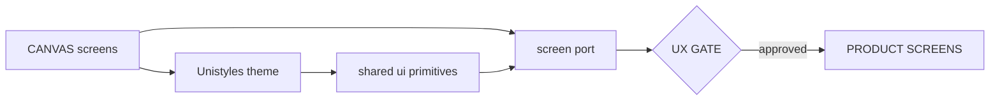

# Experience Foundation — Design Process

> Status: reset 2026-08-20 for Magic Patterns as V2 UX canon (ADR-0024).
> Gate criteria are below; current approval evidence belongs to the
> relevant Linear feature. Port rule:
> [`mapping/mp-to-mobile.md`](mapping/mp-to-mobile.md).
> Owner: human product owner.
> Companion to ADR-0024 (supersedes ADR-0019) and ADR-0020.

---

## Overview

The Magic Patterns canvas is the prototype. Expo Unistyles is the design
system. V1 mobile is read-only domain reference. Backend work may proceed
independently. The UX gate blocks **product screens in `apps/mobile`**, not
backend specs or implementation.



---

## Active stages

### 1. CANVAS

Design product surfaces on
`https://www.magicpatterns.com/c/g4fsekajwwkeex3v612gvp`. Phone-width,
sheets not desktop dropdowns, 44pt targets, no hover-only. One canvas.

A surface that is not on the canvas is not ready to implement.

**Approval:** owner reviews the screens that will ship next.

### 2. SYSTEM (Expo)

Map canvas tokens into `apps/mobile/src/theme/`. Shared controls live in
`apps/mobile/src/components/ui/`. There is no Magic Patterns design-system
preset to keep in sync. Do not install NativeWind.

**Approval:** owner reviews the running theme and primitives on a device
or simulator.

### 3. SCREEN PORT

Follow [`mapping/mp-to-mobile.md`](mapping/mp-to-mobile.md): inventory the
canvas pieces, classify shared vs feature, reuse or create, then wire
`@showzy/contract`.

**Approval:** per-screen, against the canvas.

### 4. VALIDATE

Owner (and optional reference user) evaluates internally. Label results
`internal evaluation only`.

---

## UX Gate

Product screens in `apps/mobile` are blocked until:

1. ADR-0024 and ADR-0020 are accepted.
2. Unistyles theme matches the canvas tables in `mp-to-mobile.md`.
3. The specific screen exists on the canvas.
4. Shared pieces went through `components/ui` (reuse or new primitive);
   feature pieces live under `src/features/<module>/<surface>/` (golden:
   `catalog/products`). Unmigrated screens stay in
   `components/screens/<feature>/`.
5. Interactive behavior maps to a V2 action/event or approved rework.
6. Owner evaluation of the running SYSTEM is labeled
   `internal evaluation only`.
7. Human owner records the gate as open for canvas-covered surfaces.

**Exception:** Expo shell, auth routes, and deep links are not gated as
foundation work. New auth **visuals** still follow the canvas. Google and
guest entry on the prototype must not ship (ADR-0006).

Surfaces not yet on the canvas stay blocked.

---

## Multi-flow design requirements

| Dimension | Values |
| --- | --- |
| Interaction mode | Classic UI · AI from the center tab (sheet + confirmation) |
| Persona | Staff / company owner · Consumer (discovery) · Customer (company-scoped) |
| Entry path | Search/browse discovery · Invite · Direct link |

AI calls the same actions as classic UI and cannot bypass permissions,
confirmation, or QES.

---

## Integration with the engineering pipeline

- `docs/pipeline.md` is the engineering feature loop (ADR-0023).
- Product-screen `/implement` in `apps/mobile` requires a canvas
  reference and `mp-to-mobile.md`. Backend `/feature` tickets are not
  gated. **Web** product screens require a Magic Patterns MCP read of
  the web canvas (`mp-to-web.md`); that is a mandatory canvas read, not
  the mobile UX gate.
- UI implementation tasks (`/implement`) reference the feature card, the
  Magic Patterns canvas, and `docs/design/mapping/mp-to-mobile.md` or
  `mp-to-web.md` (by app), not archived greenfield component contracts,
  archived domain specs, or Figma.
- UI acceptance: canvas intent, token fidelity, shared-vs-feature
  placement, accessibility, loading/empty/error/offline, localization,
  and internal evaluation evidence with its limitation. Classic/AI
  parity is required when `vm-T29` is in scope, not on every earlier
  UI PR.

---

## Artifact location

```
docs/design/
├── process.md
├── mapping/
│   ├── mp-to-mobile.md                    ← operating port rule (ADR-0024)
│   ├── v1-to-v2-conflict-register.md      ← product dispositions (not visuals)
│   └── v1-ux-to-v2-capability-matrix.md   ← candidate actions (not visuals)
└── system/README.md                       ← points at Expo Unistyles

docs/archive/design/
├── inventory/                 ← ADR-0019 V1 maps (not visual acceptance)
└── mapping/v1-mobile-port-recipe.md
```
